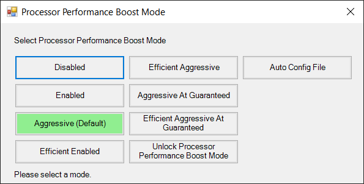

# Processor Performance Boost Mode Controller

The Processor Performance Boost Mode Controller is a Windows desktop application built using C# and WinForms. It provides a graphical user interface (GUI) to easily toggle and control the processor performance boost mode on Windows 10/11. The app allows users to choose from different boost mode settings and applies the selected setting in real-time.



## Key Features

- Simple and intuitive GUI: The app provides a user-friendly interface with buttons to select various boost mode settings.
- Real-time feedback: The app displays a label to provide feedback on the applied boost mode setting.
- Multilingual support: The app supports multiple languages, allowing users to read out the active boost mode setting in their preferred language.
- DPI-aware and scalable: The app is designed to be DPI-aware, ensuring proper scaling on different display resolutions and DPI settings.
- Auto Config File: Users can create a configuration file (`config.xml`) to automatically apply boost modes based on running applications.

## Usage

1. Launch the app: Double-click the executable file to launch the Processor Performance Boost Mode Controller.
2. Select boost mode: Click on the corresponding button to choose the desired boost mode setting.
3. Apply the setting: The app applies the selected boost mode setting in real-time.
4. Feedback: The app displays a label indicating the applied boost mode setting.
5. Auto Config File: Users can enable or disable the use of a configuration file (`config.xml`) by toggling the "Auto Config File" button. When enabled, the app checks if each application specified in the configuration file is running, and if so, applies the corresponding boost mode. The configuration file should be formatted as follows:

    ```xml
    <Config>
        <Application>
            <AppName>notepad</AppName>
            <BoostMode>Disabled</BoostMode>
        </Application>
        <Application>
            <AppName>yuzu</AppName>
            <BoostMode>Aggressive (Default)</BoostMode>
        </Application>
        <!-- Add more applications as needed -->
    </Config>
    ```

## Compatibility

The app is designed for Windows 11 and supports both 32-bit and 64-bit versions of the operating system.

## Contributing

If you want to contribute to the project, feel free to fork the repository, make improvements, and submit a pull request. Contributions are highly appreciated.

## License

The Processor Performance Boost Mode Controller is released under the [MIT License](https://opensource.org/licenses/MIT). Feel free to use, modify, and distribute the code.

## Disclaimer

The app modifies the processor's performance boost mode settings. Use it at your own risk, and ensure that you have a backup of your system settings before applying any changes.
